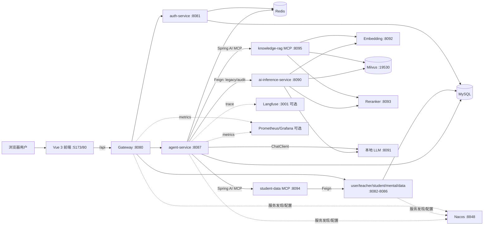
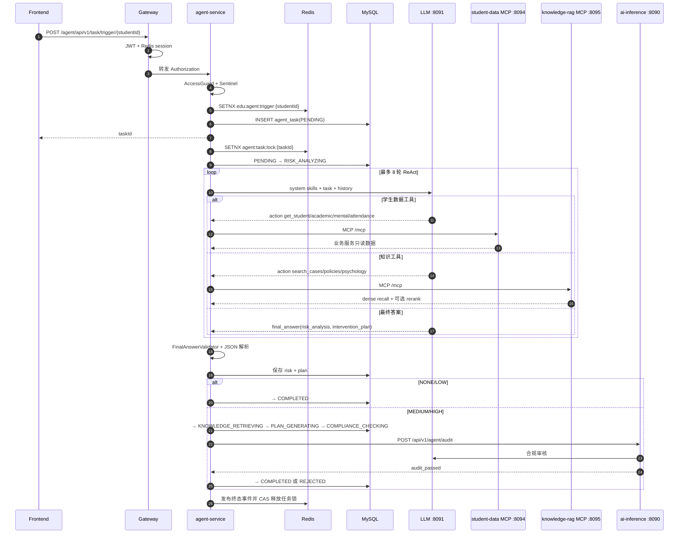

# Resource-Profile 架构说明

> 最近更新：2026-09-16
> 状态：按当前仓库实现初始化；真实模型与生产全栈仍待 `docs/educare/EXECUTION_PLAN.md` 的 R-5/R-6 验收。

本文说明项目级模块边界、核心调用链与数据流。EduCare 的历史计划与原子任务状态以 [`docs/educare/EXECUTION_PLAN.md`](./docs/educare/EXECUTION_PLAN.md) 为准；本文只描述当前仍在代码中的能力。

## 1. 系统边界

Resource-Profile 是师生资源画像与教育风险干预平台。系统由 Vue 前端、Spring Boot 微服务、Python AI 推理/RAG 服务、本地 OpenAI 兼容模型和数据基础设施组成。

### 1.1 模块职责

| 模块 | 端口 | 拥有的职责 | 不应承担的职责 |
|---|---:|---|---|
| `frontend` | 5173（开发）/ 80、443（生产） | 页面、路由、Pinia 状态、调用 `/api`、SSE 展示 | 鉴权裁决、字段脱敏、业务数据持久化 |
| `gateway` | 8080 | 路由、JWT 校验、Redis 会话白名单、`/_internal/` 阻断、CORS | 领域业务和数据库写入 |
| `common` | — | `Result<T>`、JWT、`AccessGuard`、字段权限、异常自动装配、Prompt 清洗 | 独立运行、持有领域数据 |
| `auth-service` | 8081 | 登录、刷新、登出、用户角色、Redis 会话 | 用户/学生/教师资料管理 |
| `user-service` | 8082 | 系统用户管理 | 登录发 token |
| `teacher-service` | 8083 | 教师档案 | 学生或心理业务 |
| `student-service` | 8084 | 学生档案、成绩、考勤 | 心理问卷、AI 编排 |
| `mental-service` | 8085 | 问卷、题目、作答和心理评估 | 通用用户管理、AI 推理 |
| `data-service` | 8086 | 仪表盘聚合与统计 | AI 任务状态和模型调用 |
| `agent-service` | 8087 | 风险任务、AgentLoop、合规审核编排、导出、干预反馈、SSE 预警 | 向量存储实现、业务主数据维护 |
| `mcp-student-data` | 8094 | 将学生档案、成绩、心理、考勤封装为 4 个只读 MCP 工具 | 直接拥有业务表或写业务数据 |
| `ai-inference-service` | 8090 | legacy 风险/方案/审核接口、dense RAG、诊断；知识 upsert 模块已实现但当前主应用未注册 router | 用户鉴权、业务主数据 |
| `knowledge-rag-mcp` | 8095 | 将案例、政策、心理知识检索封装为 3 个 MCP 工具 | 学生主数据、任务状态 |

### 1.2 基础设施边界

| 组件 | 用途 | 数据性质 |
|---|---|---|
| MySQL 8 | 用户、师生、心理、Agent 任务、报告、反馈 | 业务事实源，必须备份 |
| Redis 7 | 登录会话、幂等键、分布式锁、RAG/embedding 缓存、SSE 事件/检查点 | 可重建状态；丢失会导致会话失效和缓存清空 |
| Nacos 2.3 | Java 服务发现与可选配置源 | 控制面配置 |
| Milvus 2.4 + etcd + MinIO | 1024 维知识向量与索引 | 可由源文档重新灌库，不是业务事实源 |
| 本地模型 :8091/:8092/:8093 | 生成、embedding、rerank | 仓库不保存模型权重 |
| Langfuse v2 | `agent.loop`、`llm.chat` trace | 可选可观测数据 |
| Prometheus/Grafana | HTTP/JVM/Agent 指标、看板与告警 | 可选运行指标 |

## 2. 核心调用链

### 2.1 登录与普通业务请求

1. 前端调用 `POST /auth/login`。
2. `auth-service` 校验 bcrypt 密码，生成 HS256 JWT，并把 access token 写入 Redis `token:{userId}`。
3. 后续请求携带 `Authorization: Bearer <token>`；SSE 可使用 `?token=`。
4. `gateway` 先校验签名和过期时间，再比对 Redis 中的当前会话；Redis 异常时 fail-closed 返回 503。
5. 请求路由到领域服务。`AccessGuard` 做 self/role/内部调用判断，`FieldPermissionAdvice` 按角色过滤敏感字段。
6. 登出或重新登录会删除/覆盖 Redis 会话，旧 token 立即失效。

### 2.2 默认 AgentLoop 风险画像链

关键约束：

- `educare.agent.loop.enabled=true` 是默认主路径；`false` 回落 legacy 流水线。
- 默认协议是可观察的 `react`；`native` 只作为可选协议，两路都必须经过 ToolGuard 和最终答案校验。
- AgentLoop 暴露 7 个工具：`get_student_profile`、`get_academic_history`、`get_mental_indicators`、`get_attendance`、`search_cases`、`search_policies`、`search_psychology`。
- 工具调用先过白名单/敏感工具守卫；最终答案必须含合法的 `risk_analysis` 与 `intervention_plan`。
- NONE/LOW 在风险阶段短路；MEDIUM/HIGH 必须经过 Python 合规审核。审核异常返回人工审核结果并转 `REJECTED`，不能静默放行。
- 任务状态更新使用带前置状态的 CAS SQL；任何未处理异常落为 `FAILED`。

### 2.3 Legacy 回退链

当 `EDUCARE_AGENT_LOOP_ENABLED=false` 时：

1. `StudentPortraitAggregator` 通过 Feign 聚合 student/mental/data 数据并在送模前脱敏。
2. `RiskAnalyzeService` 直接调用本地 ChatClient 生成风险 JSON。
3. 中高风险调用 Python `/api/v1/rag/retrieve` 做多 query、多集合 dense 检索。
4. Python `/api/v1/agent/plan` 生成干预方案。
5. Python `/api/v1/agent/audit` 做合规审核。
6. 最终写入与默认路径相同的 `agent_task` 状态机。

Legacy 是故障回退和真实模型对比基线，不是默认新功能入口。

### 2.4 Dense RAG 数据流

1. `app/api/rag_upsert.py` 可将文本按 `none`、`fixed_size` 或 `sentence` 切块，并要求 `X-Admin-Token`；但截至本基线，`app/main.py:create_app()` 尚未 `include_router(rag_upsert.router)`，运行中的 :8090 不暴露该端点。当前灌库入口是 `scripts/init_milvus.py` + `scripts/seed_knowledge.py`；HTTP upsert 不得作为已验收能力。
2. :8092 生成 1024 维 BGE embedding；向量写入 `edu_cases`、`edu_psychology`、`edu_policies` 或 `edu_success`。
3. 检索先取 `top_k × RAG_RECALL_EXPAND` 的 Milvus 候选，再按配置调用 :8093 reranker，最后截取 `top_k`。
4. embedding 缓存默认 24 小时，RAG 结果缓存默认 1 小时。外部检索失败返回空 chunks/fallback 标志，不伪造知识。

当前实现是纯 dense 检索；历史 Hybrid Retrieval、Elasticsearch/BM25 路径已经删除。

## 3. 数据所有权与流向

### 3.1 MySQL

- 身份与权限：`sys_user`、`sys_role`、`sys_user_role`、权限关联表。
- 师生业务：`teacher_info`、`student_info`、`student_academic_record`、`student_attendance`。
- 心理业务：问卷、题目、作答、`mental_assessment`。
- Agent：`agent_task`、`intervention_report`、`knowledge_citation`、`agent_export_task`、`audit_log`。
- 干预闭环：`intervention_feedback`。

领域服务只能修改自己负责的数据；跨域读取通过 HTTP/Feign/MCP 完成，不跨服务直接复用 mapper。

### 3.2 Redis 关键键

| Key | TTL/生命周期 | 用途 |
|---|---|---|
| `token:{userId}` | access token 生命周期 | 当前登录会话白名单 |
| `edu:agent:trigger:{studentId}` | 默认 30 秒 | 防重复触发 |
| `agent:task:lock:{taskId}` | 默认 120 秒 | 防并发执行同一任务 |
| `edu:agent:schedule:daily-scan` | 定时任务窗口 | 多实例扫描锁 |
| `edu:emb:*` | 默认 24 小时 | embedding 缓存 |
| `edu:rag:*` / `edu:rag:pipe:*` | 默认 1 小时 | REST/MCP RAG 缓存 |
| `edu:rag:upsert:hash:*` | 默认 7 天 | 知识导入幂等 |

锁释放使用 value-owner 比对后删除，避免误删其他实例获得的锁。

## 4. 安全边界

- 公网生产入口只允许 nginx 80/443；gateway、数据库、Redis、Nacos、Milvus、Agent 与 MCP 端口都绑定 `127.0.0.1` 或容器内网。
- gateway 是第一道 JWT + 会话门；agent-service :8087 还有独立 `AgentSelfAuthFilter`，防本机直连绕过网关。
- `AccessGuard` 负责对象级授权；字段权限默认开启。无 token 的内部 Feign 调用可保留完整字段，因此内部网络与 MCP token 是必要前提。
- agent-service 与两个 MCP server 可通过同一 `EDUCARE_MCP_TOKEN`/`X-MCP-Token` 互验；生产 preflight 强制其与 Redis 密码均不少于 32 字符。
- 进入 LLM 的画像经过 `DataMasker`/`PromptSanitizer`；敏感心理工具还受 ToolGuard 约束。
- `/agent/**/_internal/**` 经 gateway 一律 403。任何新增内部端点必须保持该边界。

## 5. 部署形态与已知边界

- `docker/docker-compose.yml` 当前声明 AI/数据基础设施、gateway、agent-service 和两个 MCP server；它**没有**声明 auth/user/teacher/student/mental/data 六个业务服务。
- `docker/docker-compose.prod.yml` 只增加 nginx/frontend/TLS 覆盖层。因此当前仓库不能仅凭一次 `docker compose up` 宣称完整业务全栈上线；缺失的业务服务必须以宿主进程/外部部署提供，或在 R-6.2 前补齐 compose 定义并验收。
- `rag_upsert` 的路由实现和隔离测试存在，但主 FastAPI app 未挂载该 router；这是运行面与代码产物之间的已知偏差。
- `langfuse` 和 `monitoring` 都是 profile 门控，默认不启动。
- 生成模型、embedding 和 reranker 运行在宿主机，通过 `host.docker.internal` 被容器访问；权重和启动器不是仓库交付物。
- 截至 2026-09-01，真 Qwen 14B、真 BGE 质量基线、Langfuse 活 trace 和生产 TLS/备份恢复/告警全栈证据仍属于 R-5/R-6 待办。
- Render Blueprint `edu-portrait-free` 使用公网 Static Site + 多个 Free Web Service。由于 Render
  Free Web Service 不能接收私网流量，Java/MCP 服务在该预览形态通过显式 HTTPS URL 互调，不能依赖
  已关闭的 Nacos 或 `lb://` 服务发现。
- `AIVEN-RENDER-20260901` 将关系库边界改为外部 **Aiven Free MySQL**：七个 JDBC 消费者通过公网
  TLS（`sslMode=REQUIRED`）连接，凭据只在 Render 的 `edu-portrait-common-env` 手工维护；每服务
  Hikari 上限 3、最小空闲 0，整栈常态最多约 21 条数据库连接。仓库不保存 Aiven 主机、端口、用户或
  密码。会话白名单改连 `edu-portrait-kv`（Render Free Key Value）的私网 `connectionString`，不再
  把 MySQL/Redis 二进制协议伪装成 Web Service。
- 当前部署明确处于“无 LLM 供应商”模式：Render 将 `SPRING_AI_MCP_CLIENT_ENABLED=false`、
  `EDUCARE_AGENT_LOOP_ENABLED=false`，前端以 `VITE_AI_ENABLED=false` 不注册 AI 预警与 LLM 追踪
  路由。核心 Auth/User/Teacher/Student/Mental/Data 链路可独立验收；AI 能力恢复必须同时配置模型、
  RAG/MCP 依赖并重新构建前端，不能只打开菜单开关。
- `GROQ-CLOUD-20260902` 将 Render 的在线 LLM 边界切到 GroqCloud OpenAI 兼容 API：Java
  `agent-service` 使用 provider base URL，Python `ai-inference-service` 使用带 `/v1` 的 client base
  URL；两侧均关闭 llama.cpp 专用 `cache_prompt` 扩展。AgentLoop、双 MCP client 与前端 AI 路由恢复，
  knowledge-rag 在未配置 Milvus/embedding 时仍只提供既有空结果/fallback，不得表述为已完成 dense RAG。
- `MCP-TRAILING-SLASH-20260902` 明确区分两个 MCP HTTP 入口：Java student-data 保持 `/mcp`，挂载在
  FastAPI/Starlette 的 knowledge-rag 在 Render 使用规范路径 `/mcp/`。Agent 对后者使用独立 endpoint
  配置，避免 POST initialize 被 307 重定向而令 Spring AI fail-fast 退出。
- `MCP-LIFESPAN-20260903` 将 FastMCP 子应用的 lifespan 与 ai-inference 自身 lifespan 组合后注册到
  父 FastAPI；由父进程统一启动/关闭 Streamable HTTP SessionManager，避免请求已到 `/mcp/` 后因未初始化
  task group 返回 500。服务拓扑与安全边界不变。
- `GROQ-RUNTIME-CONFIG-20260903` 将 Render 的 Java/Python 生成模型固定为 Groq 组织当前允许的
  `openai/gpt-oss-120b`，并明确服务级环境变量优先于 `edu-portrait-common-env`。`agent-service` 与
  `ai-inference-service` 必须同时更新模型和服务级 `LLM_API_KEY` 覆盖值；该修复不改变服务拓扑、数据流
  或安全边界，密钥仍只存在 Render/Groq 的秘密存储中。
- `AIVEN-DNS-20260904` 记录当前 Render 数据边界的外部阻塞：已配置的 Aiven MySQL 主机名无法在
  Render 解析，导致数据库健康组件 DOWN，而 Agent liveness/readiness 与 LLM/MCP 启动链仍为 UP。
  不猜测或在仓库固化替代地址；必须从 Aiven Connection Information 取得当前端点并更新 Render secret。
  该处理不改变既定的跨云 MySQL 架构或信任边界。
- `GROQ-429-RETRY-20260904` 在 agent-service 的 Spring AI HTTP 边界只把 429 识别为可恢复错误，采用
  15 秒起始、30 秒上限、最多 3 次的指数退避。自定义 `OpenAiApi`/`OpenAiChatModel` Bean 必须显式接入
  自动配置的 `ResponseErrorHandler`/`RetryTemplate`，否则会绕过该策略。AgentLoop、MCP、数据库和安全
  边界均不改变；401/403 仍立即失败，避免掩盖无效凭据或模型权限错误。
- `GROQ-JSON-MODE-20260904` 为 Render 上的 GPT-OSS ReAct 调用启用 Groq JSON Object Mode，并将
  reasoning effort 固定为 `low`、单次最大输出限制为 1200 tokens。该配置只约束 LLM 输出协议和免费配额
  消耗，不改变 AgentLoop、MCP、数据库或安全边界；本地 OpenAI 兼容端点仍默认 TEXT 且不发送 Groq 专用值。
- `RENDER-CD-20260915` 固定 Render 的发布边界：所有服务显式跟随 `main`，且仅在被部署提交的 GitHub
  Actions CI 全部通过后部署（`autoDeployTrigger: checksPass`）；每个 Docker 服务的 `buildFilter` 按 Maven
  反应堆依赖划定（自身模块 + `common` + 父 POM + 自身 Dockerfile，gateway 同样依赖 `common`），前端仍为
  `frontend/**`。CI 的 main push 路径必须覆盖全部 buildFilter，否则提交无 check、Render 不部署。服务拓扑、
  数据流与安全边界不变。

## 6. 变更原则

- 新业务写入首先归属某个领域服务；Agent/MCP 不绕过领域边界直接写主数据。
- 新 AI 检索能力优先扩展 Python RAG 服务或 knowledge-rag MCP，不把向量逻辑复制到 Java。
- 新公网路由必须同时评估 gateway 准入、对象级授权、字段权限和审计。
- 改变状态机、工具契约、数据所有权、跨服务调用或部署拓扑时，必须同步本文、[`DECISIONS.md`](./DECISIONS.md) 与 [`RUNBOOK.md`](./RUNBOOK.md)。

## 7. 维护记录

| 日期/标识 | 变更 | 架构影响 |
|---|---|---|
| 2026-09-01 / DOC-BASELINE | 按当前代码、compose 与执行计划初始化项目级架构文档 | 建立现状基线；未改变运行时代码 |
| 2026-09-01 / RENDER-DEPLOY-20260901 | 记录 Render 无注册中心调用链、MCP 冷启动策略及免费数据服务限制 | Render 预览链改用显式 HTTPS；持久 MySQL/Redis 仍是上线硬阻塞 |
| 2026-09-01 / AIVEN-RENDER-20260901 | 外置 Aiven MySQL、改用 Render Key Value，并定义无 LLM 降级边界 | 数据层跨云 TLS；核心业务与 AI 启动依赖解耦 |
| 2026-09-01 / AI-HEALTH-20260901 | 将 Render 的 ai-inference 健康检查契约修正为 FastAPI 实际暴露的 `GET /health` | 无架构影响；仅校准部署平台与 `ai-inference-service` 的存活探针边界 |
| 2026-09-02 / LOGIN-VALIDATION-20260902 | 登录页不再施加与服务端账号策略不一致的最小密码长度限制 | 无架构影响；仅修正 `frontend` 登录表单的客户端校验边界，认证仍由 `auth-service` 负责 |
| 2026-09-02 / GROQ-CLOUD-20260902 | Render 在线 LLM 切换为 GroqCloud，并为标准 OpenAI 兼容供应商关闭 llama.cpp 专用请求字段 | LLM 推理由本地宿主机边界改为外部 HTTPS API；RAG 数据面维持降级边界 |
| 2026-09-02 / MCP-TRAILING-SLASH-20260902 | 为 FastAPI knowledge-rag MCP 使用可配置且规范的 `/mcp/` endpoint | 不改变服务边界；修正跨服务 Streamable HTTP 路径契约 |
| 2026-09-03 / MCP-LIFESPAN-20260903 | 组合 FastAPI 与 FastMCP 子应用生命周期 | 不改变服务拓扑；补齐 knowledge-rag MCP SessionManager 的进程生命周期边界 |
| 2026-09-03 / GROQ-RUNTIME-CONFIG-20260903 | 修正 Render 服务级占位密钥覆盖，并切换到组织允许的 Groq 模型 | 无架构影响；仅校准外部 LLM 运行配置及环境变量优先级 |
| 2026-09-04 / AIVEN-DNS-20260904 | 记录 Render 当前 Aiven MySQL 主机名不可解析及端点校验要求 | 无架构影响；数据库仍位于 Aiven，仅外部连接配置待修复 |
| 2026-09-04 / GROQ-429-RETRY-20260904 | 为 Groq 免费层 TPM 429 增加有界重试退避 | 无架构影响；仅增强 agent-service 外部 LLM 调用韧性 |
| 2026-09-04 / GROQ-JSON-MODE-20260904 | Render GPT-OSS 启用 JSON Object Mode 并收紧推理/输出预算 | 无架构影响；仅强化 ReAct 输出契约并降低免费 TPM 压力 |
| 2026-09-15 / RENDER-CD-20260915 | Render 固定跟随 main，CI 通过后按服务 buildFilter 增量部署 | 无运行时架构影响；发布链路受 CI 门控，构建范围与 Maven 模块依赖绑定 |

## 生产诊断维护记录：PROD-AUDIT-20260916（2026-09-16）

本次无架构影响，未修改生产配置或代码；受影响模块为 frontend、gateway、user-service、agent-service 与双 MCP 依赖。[生产验收报告](./docs/production-tests/2026-09-16/REPORT.md)记录实际调用边界：Static Site `/api` → HTTPS gateway → 业务服务，Agent 在启动时同步初始化 MCP；本次 MCP 429 导致 `mcpSyncClients` 创建失败、整个 Agent 退出。普通业务读取和教师/学生只读心理接口通过，user 冷唤醒后列表恢复，首笔 Hikari 初始化约 2.98 秒。

现状限制：生产 Langfuse 前端 URL 和后端上报配置均缺失；user `/actuator/health` 返回 HTTP 200/业务500（路由不存在），不能证明健康；生产配置清单与本地 `render.yaml` 的 checksPass/buildFilter 声明存在漂移。前端用户管理、学生学业等未接线不能等同于后端不存在能力。建议修复边界、代价和待验证事项以本报告、DECISIONS 与 RUNBOOK 为准。网关 DEBUG 日志会包含 Authorization，证据产物已剔除敏感头。

## 性能修复维护记录：PERF-500MS-20260916（2026-09-16）

业务调用仍为 Static Site → gateway → 各领域服务，JWT/Redis 会话、角色/字段权限和 MCP token 边界不变。受影响模块为 common、auth、gateway、data、agent 及 Render Java 运行配置。common 提供真实 Actuator 探针、可选数据库启动预热和不缓冲响应的 Server-Timing；Servlet/Bean 初始化前移到健康检查之前，连接池保留两条空闲连接并进行 keepalive。Render 免费实例仍可休眠，不能承诺任意地区、首次冷启动或任意大小下载均在 500ms 完成。

Agent 的 AI 触发和 PDF 提交改为显式使用有界 executor，消除同对象调用绕过 @Async 代理；队列满时标记任务失败并返回业务503，不在 HTTP 线程执行工作。Render 启用 [DeferredMcpConfiguration](./backend/agent-service/src/main/java/com/edu/agent/config/DeferredMcpConfiguration.java) 后，关闭 Spring AI 启动握手，由后台连接/重连双 MCP；仅完整工具集就绪才允许模型使用工具，未就绪不会假装成功。默认本地启动方式保持原 Spring AI MCP 装配。data 首页统计四次数据库往返合并为一条等价 SELECT，趋势过滤不再对 create_time 包裹 DATE；没有自动修改生产数据库结构。gateway DEBUG 改 INFO，避免输出鉴权头。

验收与生产部署证据见 [性能报告](./docs/production-tests/2026-09-16/PERFORMANCE.md)。R-5/R-6 不因本次性能修复自动完成。
