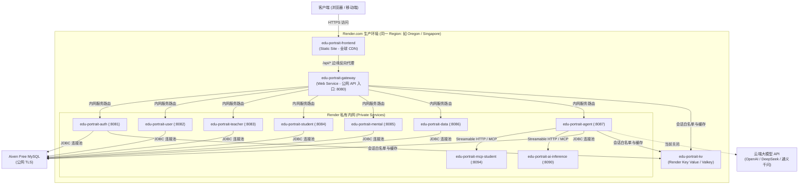

# Render.com 部署指南（预览与生产）

本文档提供**师生资源画像系统（EduCare Portrait System）**在 [Render.com](https://render.com) 云平台上的部署流程、架构说明与运维排错规范。

> **当前部署模式（2026-09-01）**：核心业务使用外部 Aiven Free MySQL（公网 TLS）与 Render Free
> Key Value；LLM 供应商暂不配置，前端不注册 AI 页面，Agent 不初始化 MCP。该形态适合功能预览，
> Aiven/Render 免费实例均无生产 SLA。完成数据导入与下文线上验收前，不得把 Dashboard 的
> `Deployed` 等同于系统可用。

---

## 目录
- [1. 架构与拓扑](#1-架构与拓扑)
- [2. 部署前准备](#2-部署前准备)
- [3. 一键 Blueprint 部署流程](#3-一键-blueprint-部署流程)
- [4. 数据库初始化 (MySQL 8.0)](#4-数据库初始化-mysql-80)
- [5. 环境变量与安全密钥配置](#5-环境变量与安全密钥配置)
- [6. 大模型与 AI 推理配置 (LLM / RAG)](#6-大模型与-ai-推理配置-llm--rag)
- [7. 前端 CDN 与接口反代](#7-前端-cdn-与接口反代)
- [8. 自定义域名与 SSL/TLS 证书](#8-自定义域名与-ssltls-证书)
- [9. 生产环境运维与排错](#9-生产环境运维与排错)

---

## 1. 架构与拓扑

生产目标拓扑遵循**纵深防御**与**最小权限原则**；当前免费预览 Blueprint 尚未达到该拓扑：

- **公网入口**：仅前端静态站点（`edu-portrait-frontend`）与后端网关（`edu-portrait-gateway`）对公网开放。
- **业务微服务**：Auth/User/Teacher/Student/Mental/Data/Agent/MCP 均作为 **Private Services (`type: pserv`)**，仅内网可见，杜绝外网未授权直连。
- **持久化数据**：MySQL 使用 Aiven Free MySQL；会话使用 Render Key Value。免费 Key Value 重启会
  清空会话，用户需重新登录。

---

## 2. 部署前准备

1. **Git 仓库**：确保本系统代码已推送到 GitHub / GitLab 私有或公开仓库。
2. **Render 账号**：登录 [Render.com](https://dashboard.render.com/)。
3. **Aiven 账号**：创建一个 Free MySQL 服务；不需要配置 LLM 供应商。
4. **MySQL 客户端**：本机安装 MySQL 8 client，用于首次执行 `sql/init/01`~`05`。

---

## 3. 一键 Blueprint 部署流程

本系统已在根目录预置经过严格测试的 `render.yaml` Blueprint 基础设施代码。

1. 进入 [Render 控制台](https://dashboard.render.com/)。
2. 点击右上角 **New +** 按钮，选择 **Blueprint**。
3. 连接您的 Git 仓库，Render 会自动识别根目录的 `render.yaml`。
4. 在 Blueprint 配置确认界面：
   - 填写 Blueprint 实例名称（如 `edu-portrait-prod`）。
   - 选择部署区域 **Region**（建议选择与大模型 API 最接近的区域，如 `Oregon (US West)` 或 `Singapore`）。
   - 不填写 `LLM_API_KEY`；保持 `VITE_AI_ENABLED=false`。
5. 应用前确认将创建免费的 `edu-portrait-kv`，并停止使用旧的 Web Service MySQL/Redis。Blueprint
   创建服务后，最终可用性仍须按第 9 节逐项验证。

---

## 4. 数据库初始化 (MySQL 8.0)

在初次部署时，需要按文件名顺序执行 `sql/init/01_init.sql` 至
`sql/init/05_intervention_feedback.sql`，不能只导入 `01_init.sql`。

### Aiven Free MySQL 初始化

1. Aiven Console 中创建 MySQL Free 服务并等待 `Running`。
2. 在 Overview > Quick connect 读取 host、port、`avnadmin` 与密码。
3. 按 [`RUNBOOK.md`](../../RUNBOOK.md) 的 `AIVEN-RENDER-20260901` 命令：先执行
   `01_init.sql`，再以 `edu_portrait` 为默认库顺序执行 `02`~`05`；连接必须带
   `--ssl-mode=REQUIRED`。
4. 在 Render 的 `edu-portrait-common-env` 手工维护 `MYSQL_HOST`、`MYSQL_PORT`、
   `MYSQL_DATABASE=edu_portrait`、`MYSQL_USER=avnadmin`、`MYSQL_PASSWORD`。这些凭据不得写入
   `render.yaml` 或提交到 Git。

**默认预置账号（密码均为用户名）：**
| 用户名 | 角色 | 默认密码 | 说明 |
| :--- | :--- | :--- | :--- |
| `admin` | 管理员 | `admin` | 系统全权限管理；上线前必须轮换 |
| `teacher` | 教师 | `teacher` | 教师画像与课程查看 |
| `student` | 学生 | `student` | 学生画像与测评查看 |

---

## 5. 环境变量与安全密钥配置

所有公共环境变量均由 `render.yaml` 中的 `edu-portrait-common-env` 统一管控：

| 环境变量名 | 描述 | 默认值 / 推荐配置 |
| :--- | :--- | :--- |
| `SPRING_PROFILES_ACTIVE` | Spring Boot 运行环境 | `prod` |
| `JWT_SECRET` | 用户会话签名密钥 | Render 自动生成 256 位随机字符串 |
| `EDUCARE_MCP_TOKEN` | MCP 节点内部鉴权 Token | Render 自动生成 256 位随机字符串 |
| `MYSQL_HOST` | MySQL 数据库主机 | Private Service 内部主机或外部云主机；不能用普通 Web Service 公网域名 |
| `MYSQL_PORT` | MySQL 端口 | Aiven Overview 显示的端口（通常不是 `3306`） |
| `MYSQL_DATABASE` | 数据库名 | `edu_portrait` |
| `MYSQL_USER` | 数据库用户名 | `avnadmin` |
| `MYSQL_PASSWORD` | 数据库密码 | Aiven 生成，仅保存在 Render |
| `MYSQL_SSL_MODE` | JDBC TLS 模式 | `REQUIRED` |
| `DB_MAXIMUM_POOL_SIZE` | 单服务最大连接数 | `3` |
| `SPRING_DATA_REDIS_URL` | Render Key Value 私网连接串 | Blueprint 从 `edu-portrait-kv` 自动注入 |
| `VITE_AI_ENABLED` | AI 页面构建开关 | 当前 `false` |

---

## 6. 大模型与 AI 推理配置 (LLM / RAG)

当前不配置供应商，必须保持：

- `SPRING_AI_MCP_CLIENT_ENABLED=false`
- `EDUCARE_AGENT_LOOP_ENABLED=false`
- `VITE_AI_ENABLED=false`
- 不设置 `LLM_API_KEY`

以后恢复 AI 时，必须同时准备模型端点、模型名、密钥和可达的 MCP/RAG 服务；先验证后端，再将
`VITE_AI_ENABLED=true` 重新构建前端。以下只作为届时的供应商示例。

### 支持的云端模型商配置示例：

- **DeepSeek API**：
  - `LLM_BASE_URL`: `https://api.deepseek.com/v1`
  - `LLM_MODEL`: `deepseek-chat`
  - `LLM_API_KEY`: 您的 DeepSeek API Key

- **阿里云通义千问 (DashScope OpenAI 兼容接口)**：
  - `LLM_BASE_URL`: `https://dashscope.aliyuncs.com/compatible-mode/v1`
  - `LLM_MODEL`: `qwen-plus` 或 `qwen2.5-72b-instruct`
  - `LLM_API_KEY`: 您的 DashScope API Key

- **OpenAI 官方**：
  - `LLM_BASE_URL`: `https://api.openai.com/v1`
  - `LLM_MODEL`: `gpt-4o-mini`
  - `LLM_API_KEY`: 您的 OpenAI API Key

---

## 7. 前端 CDN 与接口反代

`edu-portrait-frontend` 部署为 Render Static Site，具备以下生产特性：
1. **全球 CDN 加速**：静态资源（JS/CSS/图片）全球边缘节点缓存（`Cache-Control: public, max-age=31536000, immutable`）。
2. **SPA 路由兜底**：`/* -> /index.html`，刷新页面不报 404。
3. **API 边缘反代**：将 `/api/*` 请求无缝反向代理至 `edu-portrait-gateway`。
   - *提示*：在首次部署后，可在 `render.yaml` 中将 destination 确认更新为 Render 实际分配给您的网关域名（如 `https://edu-portrait-gateway.onrender.com/*`）。

---

## 8. 自定义域名与 SSL/TLS 证书

1. 在 Render Dashboard 中进入 `edu-portrait-frontend`（或 `edu-portrait-gateway`）。
2. 点击 **Settings -> Custom Domains**。
3. 添加您的自定义域名（例如 `portrait.yourdomain.com`）。
4. 按照提示在您的 DNS 服务商（如 Cloudflare, 阿里云 DNS, DNSPod）添加一条 `CNAME` 解析记录指向 Render 提供的地址。
5. Render 将自动申请并续签免费的 Let's Encrypt SSL/TLS 证书（全站 HTTPS）。

---

## 9. 生产环境运维与排错

### 1. 探活检查 (Health Checks)
- 网关与各微服务已配置 Spring Boot Actuator 端点：
  - 网关健康状态：`GET https://<gateway-domain>/actuator/health`
  - 返回 `{"status":"UP"}` 即表示网关与下游服务正常。

### 2. 内存优化 (JVM cgroups v2 适配)
- 所有 Spring Boot 容器均已配置 `-XX:MaxRAMPercentage=75.0 -XX:+UseG1GC`，动态适应 Render 容器内存分配，避免触发 OOM 杀进程。

### 3. 日志排查
- 在 Render Dashboard 中点击任意服务进入 **Logs** 选项卡，可实时查看容器输出日志。
- 若服务无法启动，优先检查：
  1. Aiven MySQL 是否 `Running`、`01`~`05` 是否已按顺序执行。
  2. `edu-portrait-kv` 是否已创建，Gateway/Auth/Agent 是否拿到同一私网连接串。
  3. `JWT_SECRET` 是否已注入且不为空。
  4. 无 Nacos 时，Agent/MCP 的 `STUDENT_SERVICE_URL`、`MENTAL_SERVICE_URL`、
     `DATA_SERVICE_URL`、`AI_INFERENCE_URL` 是否为完整 HTTPS 地址。
  5. 当前 Agent 的 MCP client 应为关闭状态；若日志仍出现 `McpSyncClient.initialize`，检查
     `SPRING_AI_MCP_CLIENT_ENABLED=false` 是否已同步并重新部署。

### 4. 当前 Blueprint 的已验证故障证据（2026-09-01）

- gateway `/actuator/health`：200，`UP`。
- `edu-portrait-mcp-student`：Feign 无固定 URL，启动卡住并触发 Render port scan timeout。
- `edu-portrait-agent`：`McpSyncClient.initialize` 连接未就绪 MCP 后退出。
- auth 合成不存在账号探测：`CannotGetJdbcConnectionException`；日志底层为 MySQL
  `SocketTimeoutException: Connect timed out`。

`AIVEN-RENDER-20260901` 已在代码侧切换到 Aiven TLS、Render Key Value 与无 LLM 降级；只有 Aiven
实例、Blueprint 同步、数据导入和核心业务登录全部实测通过后，才可把本节标记为通过。Agent 真跑不在
本次无 LLM 验收范围内。

---

*部署遇到任何问题，可随时参考官方文档 [Render Blueprint Reference](https://render.com/docs/blueprint-spec)。*
