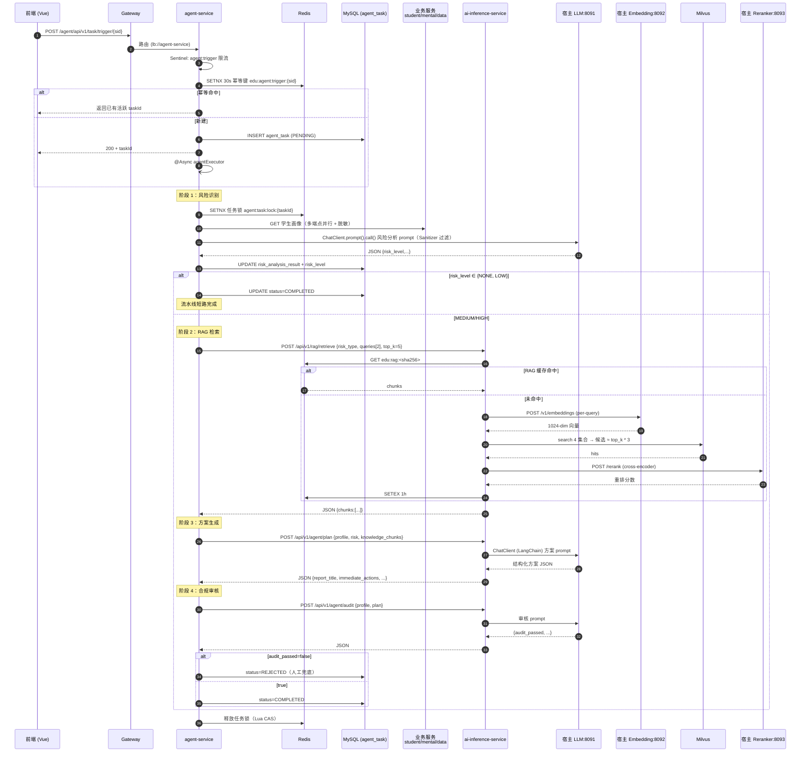

# EduCare 架构与数据流

> 师生资源画像系统 AI 子系统：**Multi-Agent 协作 + RAG 检索增强 + 本地 LLM 推理**。
> 本文档为 E-4 交付物之一，聚焦"它怎么搭起来"和"一次预警从哪里到哪里"。

---

## 1. 系统拓扑

### 1.1 组件清单

| 类别 | 组件 | 端口 | 容器化 | 职责 |
|---|---|---|---|---|
| 网关 | gateway | 8080 | docker | 路由 / CORS / 限流入口 |
| 业务编排 | agent-service | 8087 | host | Spring AI ChatClient + Feign 调用 ai-inference + 4 阶段状态机 |
| AI 推理 | ai-inference-service | 8090 | docker | FastAPI + LangChain + 4 路由（risk/rag/plan/audit）|
| LLM | llama.cpp（生成） | 8091（宿主） | host | Qwen2.5-14B Q5_K_M，Metal，3 槽位 |
| Embedding | llama.cpp（BGE） | 8092（宿主） | host | bge-large-zh-v1.5，1024 维 |
| Reranker | llama.cpp（reranker） | 8093（宿主） | host | bge-reranker-base |
| 向量库 | Milvus standalone | 19530 | docker | 4 集合（cases/psychology/policies/success）|
| 数据库 | MySQL 8 | 3306 | docker | `agent_task` / `intervention_report` / `knowledge_citation` / `audit_log` |
| 缓存/锁 | Redis 7 | 6379 | docker | RAG 缓存、Embedding 缓存、触发幂等、定时锁、任务锁 |
| 注册中心 | Nacos 2.3 | 8848/9848 | docker | 服务发现 + 配置中心 |
| 业务依赖 | student / mental / data / user / auth-service | 8084/8085/8086/8082/8081 | host | agent-service 通过 Feign 拉画像 |

### 1.2 网络与可达性

```
                  ┌──────────────────────────────────┐
                  │   宿主机 macOS（Metal GPU 推理）   │
                  │                                  │
                  │  llama.cpp:8091 (LLM)            │
                  │  llama.cpp:8092 (BGE-embed)      │
                  │  llama.cpp:8093 (BGE-rerank)     │
                  │                                  │
                  │  agent-service:8087  ──┐         │
                  │  其它 Spring Boot      │         │
                  └────────────┬───────────┼─────────┘
                               │           │ host.docker.internal:8091/8092/8093
                               │           ▼
        ┌──────────────────────┴──────────────────────────────┐
        │  Docker network: edu-network                         │
        │                                                      │
        │   ┌────────┐  ┌────────┐  ┌────────────────────┐    │
        │   │ Nacos  │  │ Redis  │  │ ai-inference:8090   │    │
        │   └────────┘  └────────┘  └─────────┬───────────┘    │
        │   ┌────────┐  ┌────────────────────┐│                │
        │   │ MySQL  │  │ Milvus + etcd      ◀┘                │
        │   └────────┘  │ + minio + attu     │                 │
        │               └────────────────────┘                 │
        │                                                      │
        │   gateway:8080 ─── 路由到所有 Spring Boot 服务         │
        └──────────────────────────────────────────────────────┘
```

关键约定：
- 宿主进程访问容器：`localhost:<published_port>`。
- 容器访问宿主进程（macOS/Windows）：`host.docker.internal:8091/8092/8093`。
- 容器之间：直接用 docker-compose service 名（如 `mysql`、`redis`、`milvus-standalone`）。
- agent-service 跑在宿主，使用 `localhost:8848`（Nacos）/ `localhost:6379`（Redis）/ `localhost:3306`（MySQL）/ `localhost:8090`（ai-inference 容器对外发布）。

---

## 2. 4-Agent 流水线（端到端时序）



### 2.1 状态机（持久化于 `agent_task.status`）

```
PENDING
   │
   ▼
RISK_ANALYZING ──(LOW/NONE)──▶ COMPLETED
   │
   │ (MEDIUM/HIGH)
   ▼
KNOWLEDGE_RETRIEVING
   │
   ▼
PLAN_GENERATING
   │
   ▼
COMPLIANCE_CHECKING ──(audit_passed=false)──▶ REJECTED
   │
   ▼
COMPLETED

任意阶段抛异常（finally 兜底） ──▶ FAILED
```

阶段流转使用 `mapper.updateStatus(id, from, to)` 的 CAS 语义（`UPDATE ... WHERE status=?`），失败抛 `IllegalStateException`，避免并发回写覆盖。

---

## 3. RAG 多路召回数据流

```
┌──────────────────────┐
│ risk_type            │ ──┐
│ root_cause_analysis  │ ──┤   形成 2-N 路 query
└──────────────────────┘   │
                           ▼
              ┌─────────────────────────┐
              │ Embedding（BGE-large-zh）│  ← Redis 缓存 24h，key=sha256(model+text)
              │ 1024-dim 向量             │
              └────────────┬────────────┘
                           │
            ┌──────────────┼──────────────┐
            ▼              ▼              ▼
      edu_cases       edu_psychology  edu_policies   edu_success
       (Milvus IVF_FLAT, IP, nlist=128, nprobe=16)
            │              │              │              │
            └──────────────┼──────────────┴──────────────┘
                           ▼
            候选集 ≈ top_k × RAG_RECALL_EXPAND（默认 3）
                           │
                           ▼
              ┌─────────────────────────┐
              │ BGE-reranker-base       │
              │ cross-encoder 重排序     │
              └────────────┬────────────┘
                           ▼
                      top_k chunks
                           │
                           ▼
              ┌─────────────────────────┐
              │ Redis 1h 缓存            │
              │ key=sha256(req_payload) │
              └────────────┬────────────┘
                           ▼
                返回 agent-service（plan 阶段输入）
```

- 缓存粒度：embedding 单文本级（24h），RAG 整次请求级（1h）。
- 任一外部组件不可用 → 走零向量 / 空 chunks 降级，链路不阻断。
- 4 集合 schema 一致：`id`/`chunk_id`/`title`/`content`/`source`/`embedding(1024)`，索引在 `embedding` 字段，metric_type=IP。

---

## 4. 数据持久化

### 4.1 关键表（`sql/init/03_agent_init.sql`）

| 表 | 作用 | 关键索引 |
|---|---|---|
| `agent_task` | 任务主表 + 4 阶段产物 JSON | `idx_student_status` / `idx_status_created` / `idx_risk_level` |
| `intervention_report` | 任务完成后聚合，前端报告页消费 | `uk_task_id` / `idx_student` |
| `knowledge_citation` | 回填本次方案引用了哪些 chunk | `idx_task` |
| `audit_log` | 触发 / 查看 / 导出 / 拒绝等审计行为 | `idx_action_time` |

逻辑删除：`deleted` 字段，1 = 删，0 = 在；MyBatis-Plus 全局配置已开。

### 4.2 Redis Key 规范

| Key 模板 | TTL | 设置点 | 用途 |
|---|---|---|---|
| `edu:agent:trigger:{studentId}` | 30s | trigger 入口 | 触发幂等窗口 |
| `agent:task:lock:{taskId}` | 120s | asyncExecute | 任务执行锁（避免重调度并发） |
| `edu:agent:schedule:daily-scan` | 1h | 定时扫描 | 多实例分布式锁 |
| `edu:emb:<sha256>` | 24h | EmbeddingClient | embedding 缓存 |
| `edu:rag:<sha256>` | 1h | rag.py | RAG 整请求缓存 |

所有锁释放走 Lua `CAS-DEL` 保证 owner 一致。

---

## 5. 安全 & 生产化要点（D 阶段成果）

- **限流**：Sentinel `agent:trigger` 资源；`triggerBlocked` fallback 返回 HTTP 429。
- **幂等**：30s 同 sid 复用最近活跃任务；定时扫描复用同一逻辑。
- **Prompt 注入**：`PromptSanitizer` 在 ChatClient 调用前过滤角色切换 / 越权指令模式。
- **PII 脱敏**：`DataMasker` + `StudentPortraitAggregator` 在传给 LLM 前打码（学号 / 姓名）。
- **审计**：`audit_log` 记录关键操作；`compliance_audit` 字段保存合规 LLM 的判定。
- **降级链**：mental / data / RAG / plan / audit 失败均有 fallback；只有数据库 / 锁失败会真 FAILED。

---

## 6. 进一步阅读

- 部署与日常运维：[`deploy.md`](./deploy.md)
- 验收 checklist：[`acceptance.md`](./acceptance.md)
- 阶段执行计划：[`EXECUTION_PLAN.md`](./EXECUTION_PLAN.md)（Phase G/H/I 原子任务 + 下一步指针）
- 改进设计源：[`IMPROVEMENT_2026_MAY.md`](./IMPROVEMENT_2026_MAY.md)（v1.1 拍板）
- DDL：[`/sql/init/03_agent_init.sql`](../../sql/init/03_agent_init.sql)
- Java 主入口：[`AgentTaskServiceImpl`](../../backend/agent-service/src/main/java/com/edu/agent/service/impl/AgentTaskServiceImpl.java)
- Python 路由：[`/ai-inference-service/app/api/`](../../ai-inference-service/app/api/)
